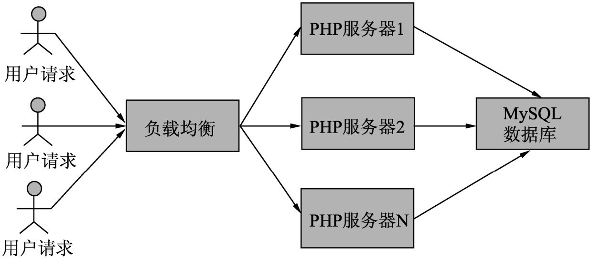
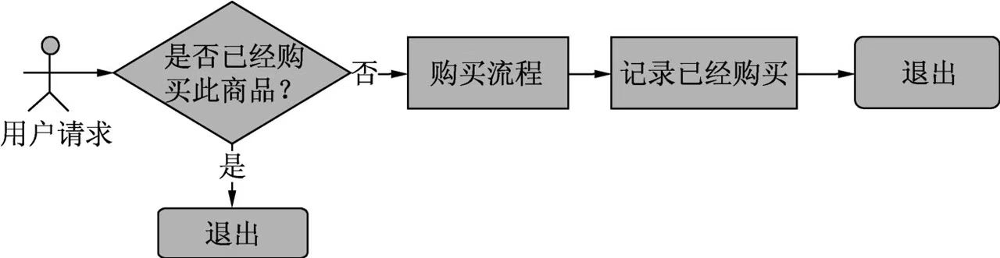
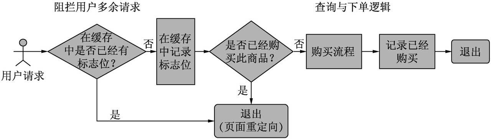
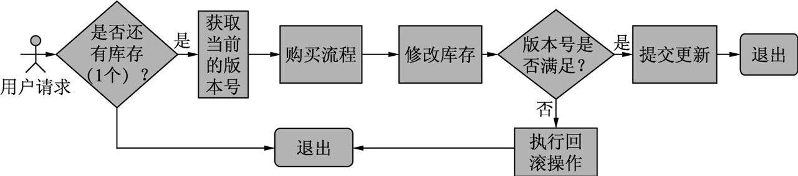
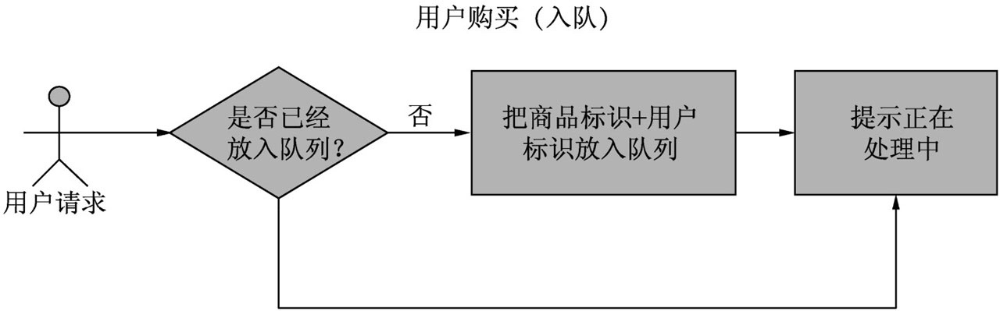
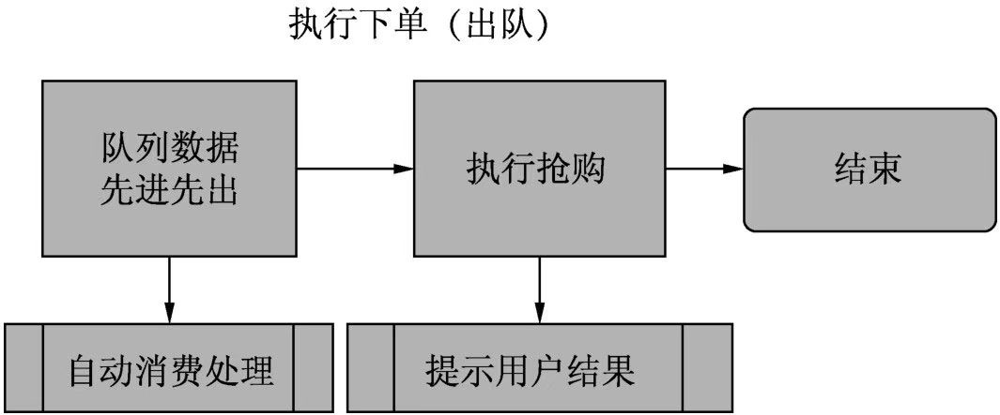
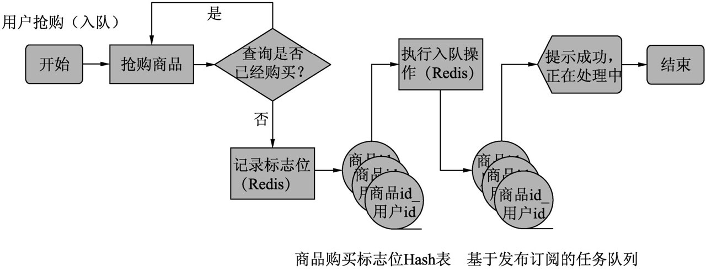
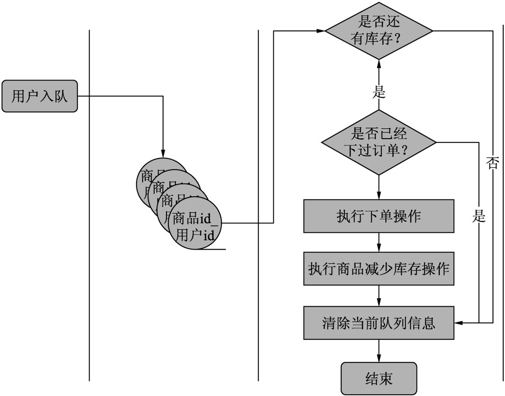
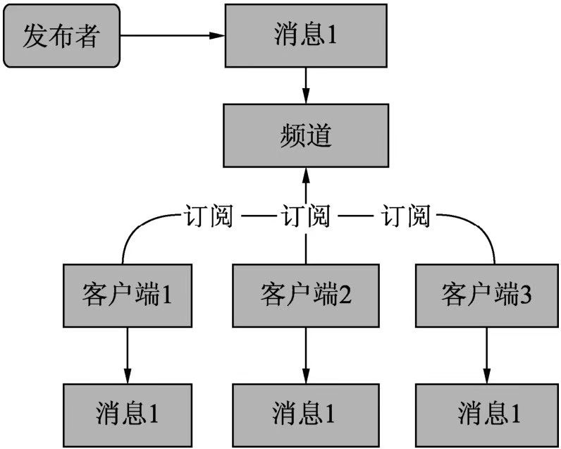

# 商城抢购功能设计

## 问题

商城抢购主要面临着两个问题：

1. 高并发，对服务器造成巨大压力
2. 容易导致超卖，当库存仅剩下 1 件时，如果同时有两个人抢购，会导致库存变成 -1

## 解决

### 服务器层面 - 负载均衡

对于单台应用服务器的架构，无法通过无限地升级单台服务器的硬件配置来提升性能，毕竟服务器软件本身也会有瓶颈。为了解决这个问题，引入了服务器集群，即使用负载均衡器，把请求分发到各个应用服务器中，减缓单台应用服务器的压力，提高服务器的处理能力。

### 请求层面 - 减少重复请求

在商品抢购这个应用场景下，暂且约束用户每次只能抢购一个商品，那么每个账号在购买前，都需要查询是否购买过此商品。

为了避免大量的数据库查询请求，可使用缓存来进行标记用户是否已抢购

此外，可以限制用户只能单端登录，避免用户多端下单。

### 数据库层面 - 乐观锁和悲观锁

* 悲观锁。**每次去拿数据的时候都认为别人会修改**，所以每次在拿数据的时候都会上锁，这样别人想拿这个数据就会 block 直到它拿到锁。传统的关系型数据库里边就用到了很多这种锁机制，比如行锁，表锁等，读锁，写锁等，都是在做操作之前先上锁。

* 乐观锁。**每次去拿数据的时候都认为别人不会修改**，所以不会上锁，但是在更新的时候会判断一下在此期间别人有没有去更新这个数据，可以使用版本号等机制。乐观锁适用于多读的应用类型，这样可以提高吞吐量，像数据库如果提供类似于 write_condition 机制的其实都是提供的乐观锁。

乐观锁解决超卖问题：

虽然保证了数据的一致性，但当在高并发场景下，会有大量的请求在等待锁，可能会出现某些请求无法抢到商品，也就导致了常见的死锁，导致系统处理能力降低，响应时间变长。

### 系统设计层面 - 使用队列

使用队列来解决该问题，实际上是规避了并发请求直接到达数据库的问题。所有的请求统一进入到队列（内存），遵循先进先出的规则，逐一消费处理。

入队 - 用户购买

出队 - 系统下单

以下是具体的设计方案：

* 抢购 - 每个商品对应一个 `Hash` 表（可取名为 `goods_商品id`)，用户每次的抢购请求都会记录在表中，记录格式为 `商品id_用户_id`，根据该记录可判断用户是否重复发出请求。

* 下单。因为队列遵循的是先进先出原则，一个队列只对应一个消费进程，此进程不停地进行出队操作即可。

这里的原理其实是 Redis 的消息发布/订阅机制

* 发布者发送消息到特定频道
* 订阅者通过观察频道来接受消息

该模式与本例子的对应关系如下：

* 发布者：用户
* 发布者发布消息：用户发布抢购信息到某个频道（队列中）
* 订阅者（PHP 消费脚本负责获取队列信息并进行后续操作）

