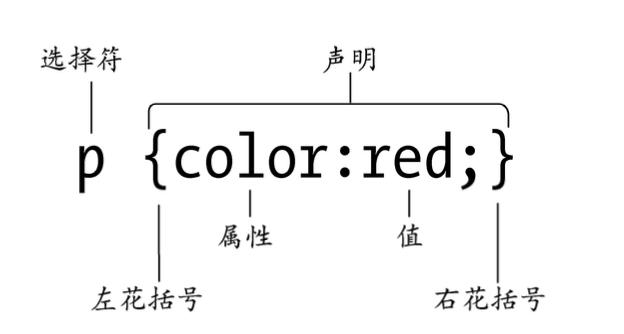
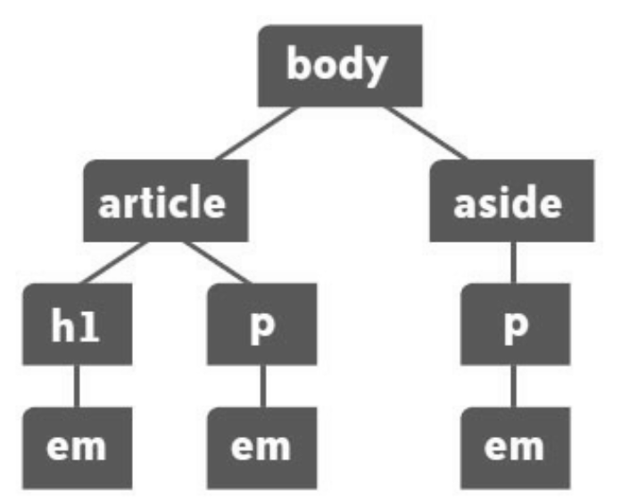
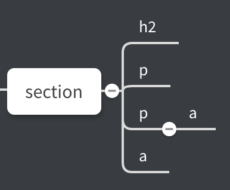

# CSS 使用原理

## 为文档应用样式

为文档应用样式主要有三种方式，优先级顺序为内联 > 嵌入 > 链接。

内联 - 通过标签的 `style` 属性为标签添加样式

```css
<!-- 内联样式 --> 
< p style="font-size:25p"> 
```

嵌入 - 放在文档头部的 `style` 标签中一组 CSS 样式

```css
<!-- 嵌入式样式 --> 
<style> body {background-color:#FFC;} </style>
```

链接 - 将样式放到一个单独的文档中，然后链接到一个或多个页面 

```css
<!-- 链接样式 --> 
<link href = "layout.css", rel="stylesheet">
```

## 命名

CSS 规则由选择符和声明组成，声明又包括属性和值




一条规则包含多个声明

```css
p {color:red; font-size:12px; font-weight:bold;}
```

多个选择符进行组合

```css
h1 {color:blue; font-weight:bold;} 
h2 {color:blue; font-weight:bold;} 
h3 {color:blue; font-weight:bold;}
```

多条规则应用给一个选择符

```css
h1, h2, h3 {color:blue; font-weight:bold;}
h3 {font-style:italic;}
```

## 选择器

选择器的分类

* 上下文选择器 - 基于祖先或同胞元素
* ID 和类选择器 - 基于 id 和 class 属性的值
* 属性选择器 - 基于属性的有无和特征
* 其他选择器 - 伪类、伪元素等

### 上下文选择器



基本选择符 - 对所有后代生效

```css
<!-- 对所有 em 元素生效 -->
em {color:green;}

<!-- 对 article 元素下的所有 em 生效 -->
article em {color:green;}

<!-- 对特定 em 生效 -->
article h1 em {color:green;}
```



子选择符 `>` - 只对直接子元素生效

```css
<!-- 只对 section 的直接子元素 h2 生效 -->
section > h2 {font-style:italic;}
```
紧邻同胞选择符 `+` - 对相邻的同胞元素生效

```css
h2 + p {font-variant:small-caps;}
```

一般同胞选择符 `~` - 同胞即可

```css
h2 ~ a {color:red;}
```

通用选择符 `*` - 匹配任意元素

```css
<!-- 所有元素生效 -->
* {color:green;}
<!-- p 包含的所有元素生效 -->
p * {color:red;}
```

通用选择符可与元素构成非子选择符

```css
<!-- 只对孙子元素生效 -->
section * a {font-size:1.3em;}
```

### ID 和类选择符

ID 是页面的唯一标识，每个 ID 在页面中只能使用一次，利用 ID，可以快速的定位到所需要的元素，排除无关的上下问。而类则是为了标识一组具有相同特征的元素。

单独使用类

```css
p {font-family:helvetica, sans-serif; font-size:1.2em;}
.specialtext {font-style:italic;}
```

标签结合类

```css
p.specialtext {color:red;}
```

元素同时存在多个类时生效

```css
.specialtext.featured {font-size:120%;}
```

ID 选择符与类选择符用法一样

```css
#specialtext {font-style:italic;}
p#specialtext {color:red;}
```

### 属性选择器

属性名选择

```css
img[title] {border:2px solid blue;}
```

属性值选择

```css
img[title="red flower"] {border:4px solid green;}
```

### 伪类选择器

伪类可分为两类：

* UI 伪类 - HTML 元素处于某个状态
* 结构化伪类 - 标记中存在某种结构上的关系

UI 伪类 - 链接伪类

```css
<!-- 点击 -->
a:link {color:black;} 
<!-- 此前点击过 -->
a:visited {color:gray;} 
<!-- 悬停 -->
a:hover {text-decoration:none;} 
<!-- 正在被点击 -->
a:active {color:red;}
<!-- 可应用到一些其他元素上 -->
p:hover {background-color:gray;}
```
UI 伪类 -  focus 伪类

```css
<!-- 用户点击时获取焦点 -->
input:focus {border:1px solid blue;}
```

UI 伪类 -  target 伪类

```css
<!-- <a href="#more_info">More Information</a> -->
<!-- 用户点击一个指向页面中其他元素的链接 -->
#more_info:target {background:#eee;}
```

结构化伪类 - `:first-child` 与 `:last-child`

```css
<!-- 一组同胞元素中的第一个元素 -->
ol.results li:first-child {color:blue;}
<!-- 一组同胞元素中的最后一个元素 -->
ol.results li:last-child {color:red;}
```

结构化伪类 - `:nth-child(n)`

```css
<!-- 选择第三项 -->
li:nth-child(3)
<!-- 选择所有奇数项 -->
li:nth-child(odd)
<!-- 选择所有偶数项 -->
li:nth-child(even)
```

### 伪元素选择器

`::first-letter`

```css
<!-- 首字符 -->
p::first-letter {font-size:300%;}
```

`::first-line`

```css
<!-- 首行 -->
p::first-line {font-variant:small-caps;}
```

`::before` 与 `::after` 在元素前或元素后添加特殊内容

```css
p.age::before {content:"Age: ";} 
p.age::after {content:" years.";}
```

## 继承

CSS 的祖先元素会向后代传递属性的值，有的属性（文本属性等）将会被后代完全继承，有的属性则不会（间距等）

```css
body {font-family:helvetica, arial, sans-serif;}
```

## 层叠

不同的样式会被层叠在一起，主要有两个原因：

* 样式来源于多个地方，因此需要考虑顺序的优先级；
* 样式存在多个，因此需要考虑权重的不同；

样式来源于很多地方：

* 浏览器默认样式
* 用户样式表（不常见） - IE 的辅助功能允许用户添加样式表
* 设计者样式表 - 自己编写的 CSS 样式

当这些样式层叠在一起，会按照以下顺序进行排序

> 浏览器样式 < 用户 < 链接 < 嵌入 < 内联

权重计算：每个样式的分值用 A-B-C，可近似看成三位数，分值越高，权重越高，当权重一样时，后面的覆盖前面。

* 存在一个 ID，A 加 1
* 存在一个类，B 加 1
* 存在一个元素，C 加 1

```css
p : 1     
p.largetext: 11  
p#largetext: 101  
body p#largetext: 102 
body p#largetext ul.mylist: 113 
body p#largetext ul.mylist li: 114
```

对样式的优先级进行一般性概括：

1. 包含 ID 的选择符覆盖只包含类的选择符，包含类的选择符覆盖只包含标签的选择符
2. 内联覆盖嵌入，嵌入覆盖样式表；但是，规则1 始终优先于 规则2
3. 定义的样式覆盖继承的样式
4. 如果两条规则具有相同权重，后面的规则覆盖前面的

## CSS 的值

CSS属性值主要可以分为三类：

* 单词 - bold、small 等
* 数字值 - 绝对值、相对值
* 颜色值 - 十六进制值、RGB、颜色名

### 颜色

颜色有三种表示方法：

* 命名
* 十六进制
* 百分比

CSS 规范定义了 17 个基本颜色名，当然，浏览器支持的颜色名不止这些

```
aqua、black、blue、fuchsia、gray、green、lime、maroon、navy、olive、orange、purple、red、silver、teal、white、yellow
```

RGB 表示法将用百分数三元组或整数三元组来表示颜色，RGB 分别代表红、绿、蓝使用的百分比，通过对其叠加，实现想要的颜色效果

```
红  - rgb(255,0,0) 或 rgb(100%, 0, 0)
绿  - rgb(0,255,0)
蓝  - rgb(0,0,255)
黑  - rgb(0,0,0)  
白 -  rgb(255,255,255) 
```

十六进制实际上与 RGB 的整数三元组一样，只不过一个使用十进制数，一个使用十六进制数，因此，可以将常用颜色三种表示法罗列出来

|命名法|RGB 法|十六进制法|
|:-----:|:------:|:--------:|
|black 	|#000000| rgb(0,0,0)|
|red	|#FF0000| rgb(255,0,0)|
|green	|#00FF00| rgb(0,255,0)|
|blug 	|#0000FF| rgb(0,0,255)|
|yellow	|#FFFF00| rgb(255,255,0)|
|aqua(青绿色)	|#00FFFF| rgb(0,255,255)|
|peony(牡丹红) |#FF00FF| rgb(255,0,255)|
|gray |#C0C0C0| rgb(192,192,192)|
|white	|#FFFFFF| rgb(255,255,255)|

### 数字值

数字值通常包括：

* 绝对值
* 相对值

绝对值

|表示|含义|说明|
|:-----:|:------:|:--------:|
|in|英寸| 来自于美国尺子，1 in = 2.54 cm|
|pt|磅|来自于印刷行业，全称 point，但是通常称之为磅, 1 pt = 1/72 in|
|pc|十二点活字|来自于印刷行业，全称 pica，1 pc = 12 pt|
|cm|厘米||
|mm|毫米|

相对值

|表示|含义|说明|
|:-----:|:------:|:--------:|
|px|像素|全称 pixel，图像采集的基本单位|
|em ||1em 等于当前的字体尺寸|
|ex||1ex 为当前字体的小写字母 x 的高度|
|%|| 50% 为当前浏览器的宽度的一半|

应用举例 

* `body` 设置为 `1 em`，作为基准
* `p` 设置为 `0.8 em`
* `a` 设置为 `0.7 em`
* 如果将 `body` 的值改为 `1.2 em`，全部文本都会增大 `20%`

