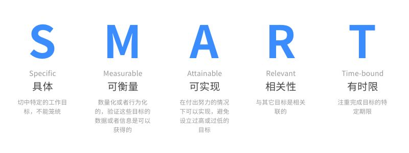

# 主动学习

心智阅读系列主要记录的是自己的阅读与思考，大多与技术无关。本次分享的是 [程序员的思维修炼](https://book.douban.com/subject/5372651/) 一书的第六章主动学习。

## 自我教育

我们先从教育这个词说起，教育（Education）的词根为 educare，即被引出，也就是说，教育含有**从学习者那里引导出一些东西**的意思。

好的自我教育应当是 **主动学习**，而且在三个方面都应当「主动」：

* **主观的意愿**。学习不是强加给你的，而是需要你主动去做的事情；
* **主动地实践**。仅仅掌握知识，而不去实践，没有用；
* **系统的方法**。随机的方法，没有目标和反馈，往往会导致随机的结果。

接下来详细的介绍如何主动学习。

## 1. 列出目标与任务

目标就是你的大目标，而任务则是与目标高度相关的具体的可行性的小目标。

示例：

* 列出目标  - 掌握 PHP
* 为目标制定相关任务（子目标）

	* PHP 基础
	* PHP 核心特性
	* PHP 安全
	* PHP 函数库
	* PHP 组件化
	* PHP 优化
	* ...

## 2. 每一个小目标都要符合 SMART 法则

每一个与目标相关的任务或者子目标，都应当符合 SMART 法则。

具体的

* ❎ 想学 PHP
* ✅ 用 PHP 构建一个 BBS

可度量的

* ❎ 看 PHP 手册
* ✅ 循序渐进的度量：本周看完 PHP 手册基础篇，并且用自己的语言总结并发表

可实现的

* ❎ 三个月内精通 PHP、Laravel、Swoole
* ✅ 一个月掌握 PHP 的核心特性

时间可控的

* ❎ 最近要学会 PHP
* ✅ 1 - 2 天看完 PHP 手册的一个主题，三个月看完 PHP 手册

相关的

* 这个目标对你重要吗？跟你有关系吗？
* 你对此有热情吗？
* 你能够掌控该目标？

为了进一步理解什么是与目标相关的，可以将目标置于更大的背景下考虑：

* 家庭
* 事业
* 财务
* 社区
* 环境
* 自我成长

## 3. 定期投资自己的知识

知识和经验就是最重要的职场资本，它们就是你的价值所在。然而，它们却是有时效的。你的知识资产会随着技术的更新换代而逐渐过时，随之而来的就是你的个人价值的不断降低。因此，我们需要有效的管理自己的知识资产。

为什么要定期投资自己的知识，如何投资自己的知识，我已经在之前的 [文章](https://learnku.com/articles/36080) 提到过。这里简单的介绍：

* 要有定期进行自我投资的意识，而不是等着空闲时间再学习。因为根本不存在什么所谓的空闲时间，时间都是是分配出来的；如果将学习活动流放到空闲时间去上，就等同于失败。

* 对知识的投资与对金钱的投资是一样的，采取的策略也是一样的。比如复利、多元化、风险管理、低买高卖等等；

* 对知识的自我投资的核心在于长期投资，养成自我投资的习惯，保持大周期的刻意练习，最终你的知识会想滚雪球一样；

* 制定具体计划。现在、本周、本月、本季度、本年等等。计划并非一层不变的，会不断的调整，但是计划一定要做，因为做计划的过程比计划本身更重要。 

## 4. 加入学习小组

互联网提供了一种方式，连接不同城市的异类。组队学习让异类遇到异类。人要可持续成长，需要满足自主、胜任、归属的需求。小队带给成员归属感，这种归属感是建立在个人投资和相互依赖的基础上的。小队里的每个成员都是具有欣赏能力的受众，在必要的时候也能够给其他成员带来技术支持和情感支持。

关于组队学习，我已经发表过类似的[文章](https://learnku.com/articles/35334)。总的来说，组队学习是一种高效的学习方式，但是心血来潮发起的组队学习大都也将以失败告终。根据个人经验，以下学习小组比较容易取得成功：

* 导师制。导师带队，成员以认知学徒的身份参与。
* 项目制。围绕一个项目，展开学习，在实践的过程中构建知识。

## 5. 采取主动学习的方法

主动学习的方法，市面上已经有很多了，比如 SQ3R 阅读法，费曼学习法、思维导图、卡片学习法等，这里不一一说明。个人比较推崇的方式卡片学习法，每天坚持撰写技术卡片，能保证最低限度的输出。卡片写多了，就可以将其组织成文章，如果一开始就强行自己输出文章，很容易导致行为瘫痪。

